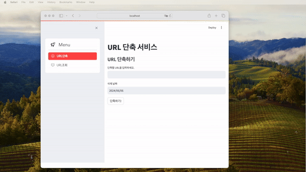
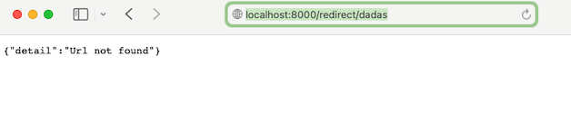
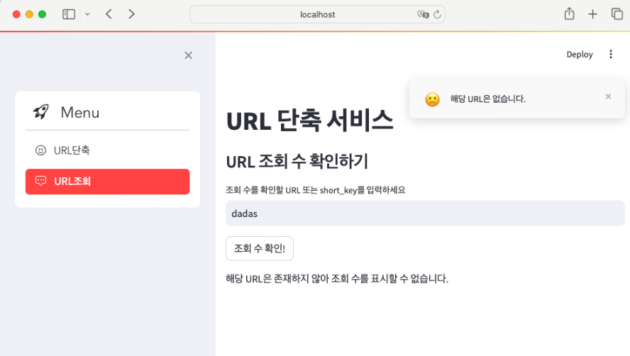
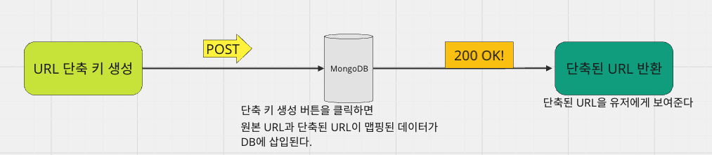
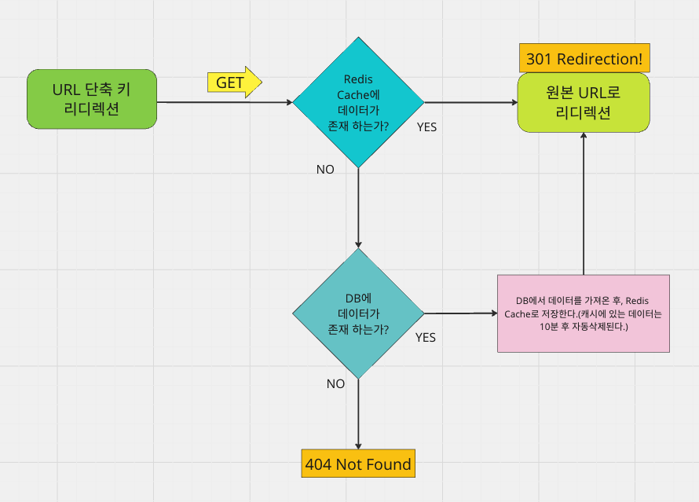
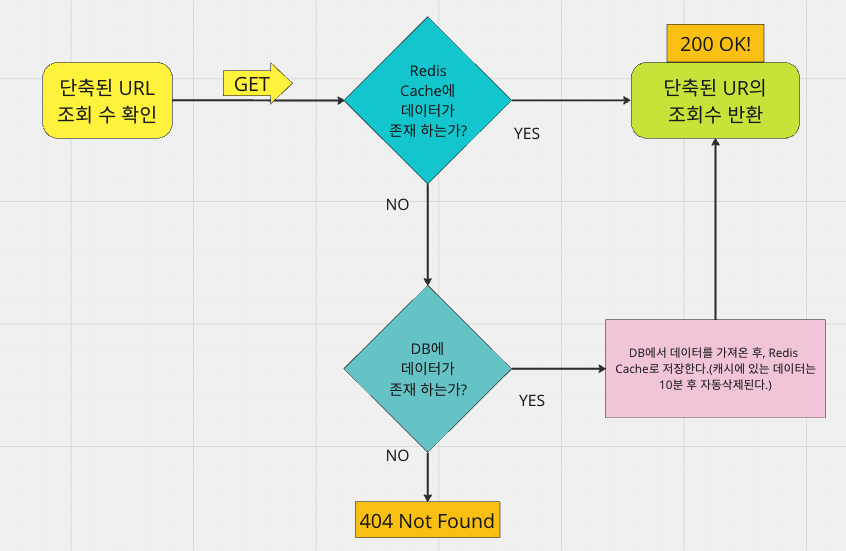

## 과제: URL 단축 서비스 구현

### Tech
 


## 시연 과정

---


- 긴 URL로 부터 만기 날짜를 지정하고 단축된 URL을 생성한다. (만기날짜에 해당 URL에 대한 데이터는 MongoDB내에서 자동으로 삭제된다.)
- 생성된 단축 URL을 통해 접속(리디렉션)한다.
- 리디렉션 후 조회 수를 확인한다.

### 존재하지 않는 URL 접근시


### 존재하지 않는 URL의 조회 수 확인시


## Service Flow

---

- 단축된 URL을 생성




- 단축된 URL 접속(리디렉션)




- 단축된 URL의 조회 수 확인



## 파일설명

---
### app.py
- 간단한 서비스의 화면을 빠르게 구현하기 위한 프레임워크 Streamlit을 사용한 코드가 작성되어 있습니다.
- Streamlit 서버를 가동할 시 해당 파일을 로드합니다.

### backend.py
- FastAPI를 사용한 Backend API가 작성되어 있습니다. 
- FastAPI 서버를 가동할 시 해당 파일을 로드합니다.
- Swagger를 확인해보면 아래와 같은 API의 엔드포인트 목록을 확인할 수 있습니다.


### generate_short_key.py
- 해당 서비스의 키 생성 알고리즘 로직이 작성되어 있습니다.
- 해당 파일에는 아래 두 가지 키 생성 알고리즘이 작성되어 있습니다.

> 1. generate_random_string 함수 (랜덤 생성방식) 
> 
> 장점 : 코드가 간단하고 이해하기 쉽다. 중복된 코드 발생 및 충돌 가능성이 낮다.
> 
> 단점 : 중복된 코드가 발생될 가능성이 있으므로, 키 생성마다 DB에서 중복된 코드가 있는지 조회해야 한다.

> 2. Base 변환을 기반으로한 키 생성방식
> 
> 장점 : COUNT를 증가시켜가면서 키를 생성하기 때문에 중복된 코드 발생이 일어나지 않는다. 따라서 키 생성시 중복된 키가 있는지 DB를 조회할 필요없다. 
> 
> 단점 : 코드가 다소 복잡하다.

해당 서비스에서는 2번 `Base 변환을 기반으로한 키 생성방식`을 채택하였습니다.

### batch.py
- 해당 파일은 Redis 캐시에 저장되어있는 key-value를 Main DB인 MongoDB로 동기화하는 코드가 작성되어 있습니다.
- 사용자가 단축된 URL을 통해 리디렉션할 때 조회수를 증가시켜야 합니다.
- 하지만 사용자가 리디렉션 할 때마다 직접적으로 MongoDB에 있는 데이터 필드에 접근하여 Update할 경우 트랜잭션의 과부하가 일어날 수 있을 것으로 보입니다.
- 따라서 사용자가 리디렉션할 때는 먼저 Redis Cache에서 업데이트하고,
- 특정 시간마다(예를들어 5분마다) batch.py파일을 가동하여 캐시에 저장된 key-value를 불러와서 동기화(업데이트) 하면 트랜잭션의 과부하를 줄일 수 있을 것으로 보여 해당파일을 작성하였습니다. 


## 데이터베이스 선택 이유

---
해당 서비스는 MongoDB를 메인DB로 사용하고, 캐시 저장용으로 Redis를 사용하고 있습니다. 
### MongoDB 사용이유
- 시간대에 따른 조회 수 시각화 기능과 같이 조금 더 복잡한 데이터를 컨트롤할 때, MongoDB에서 제공하는 Aggregation Pipeline으로 유연하게 다룰 수 있습니다. 따라서 후에 있을 기능추가에 있어서도 확장성이 좋습니다.
- MongoDB는 대규모 서비스에 대비한 Sharding을 이용한 분산처리가 가능합니다. 따라서 장기적, 안정적으로 데이터를 보관할 수 있습니다.

### Redis 사용이유
- Redis의 Cache Server 사용 시 같은 요청에 대해 매번 데이터베이스를 거치는 것이 아닌, Cache Server를 거쳐 결과값이 존재할때 빠르게 반환을 받을 수 있습니다.
- 이는 서비스 속도 향상 및 데이터베이스 트랜잭션 부하 감소에 도움될 것으로 판단하여 선택하였습니다.


## 사용법(환경설치)

---

- Python 3.11

### MongoDB (MAC 사용기준)
- MongoDB 설치
```commandline
brew install mongodb-community@5.0
```
<br>

- MongoDB 실행
```commandline
brew services start mongodb-community@5.0
```
<br>

- MongoDB 정지
```commandline
brew services stop mongodb-community@5.0
```

<br>

### Redis (MAC 사용기준)
- Redis 설치
```commandline
brew install redis
```
<br>

- Redis 실행
```commandline
brew services start redis
```
<br>

- Redis 정지
```commandline
brew services stop redis
```
<br>

### 라이브러리 설치
```commandline
pip install -r requirements.txt
```

## 실행방법

---
- FastAPI 서버 가동
```commandline
uvicorn backend:app --reload
```

- Streamlit 서버 가동
```commandline
streamlit run app.py
```
